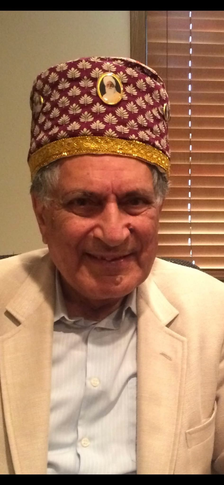

# Sant Mat: The Path of the Masters

  

  ### Great Master Baba Sawan Singh Ji (1858–1948)
  > *"The soul is a drop from the divine Ocean, and its ultimate destiny is to merge back into its Source through the practice of Surat Shabd Yoga."*

---

## The Sant Mat Lineage: Baba Jaimal Singh Ji & Great Master Sawan Singh Ji

### Founder Baba Jaimal Singh Ji (1839–1903)
Baba Jaimal Singh Ji was the first spiritual master and founder of the center at Beas (RSSB). Guided by an intense inner quest for the *Anhad Shabad* (Inner Sound), he became a devoted disciple of Swami Shiv Dayal Singh Ji (Soami Ji Maharaj) in Agra. After retiring from his service in the British Indian Army, he established the spiritual sanctuary on the barren banks of the Beas River, laying the foundational roots of the modern global Sant Mat mission.

#### The Fateful Meeting: Choosing the Successor
During his travels, Baba Jaimal Singh Ji traveled to the hill station of **Murree** (now in Pakistan), where Sawan Singh—then a young military engineer—was earnestly searching for true spiritual guidance. As Sawan Singh walked past Baba Jaimal Singh Ji and a companion one day without offering a greeting, Baba Jaimal Singh stopped, looked after him, and declared with divine certainty: 

> *"I have come to Murree for this person."*

When his companion noted that the young man hadn't even acknowledged him, Baba Jaimal Singh calmly replied, *"He will come to attend the satsang in three days hence."* True to his word, Sawan Singh arrived at the gathering three days later, his doubts dissolved upon hearing the discourse, and he was initiated. Recognizing his profound spiritual capacity and devotion, Baba Jaimal Singh Ji entrusted him with the heavy responsibility of carrying on the lineage.

### Great Master Baba Sawan Singh Ji (1858–1948)
Fulfilling his master's vision, Baba Sawan Singh Ji served as the second spiritual head from 1903 until 1948. Over his 45-year ministry, he transformed Beas from a remote outpost into a thriving spiritual colony, initiating tens of thousands of seekers into the practice of *Surat Shabd Yoga* (the Path of the Sound Current) and expanding the universal teachings of the Masters globally before passing the mantle onward.

---

## Repository Navigation

Explore the core documents and resources included in this repository:

*   **[Master Toolkit](master-toolkit.md)** – Access daily reflections, invocations, and primary project notes.
*   **[Sant Mat Outline](sant-mat-outline.md)** – Review the structural framework, key concepts, and roadmap for the tradition's teachings.

  

  ### Great Master Baba Sawan Singh Ji (1858–1948)
  > *"The soul is a drop from the divine Ocean, and its ultimate destiny is to merge back into its Source through the practice of Surat Shabd Yoga."*

name: GitHub Traffic Log Backup

on:
  schedule:
    # Runs automatically every night at midnight UTC
    - cron: '0 0 * * *'
  # Allows you to trigger the action manually anytime from the Actions tab
  workflow_dispatch:

permissions:
  contents: write

jobs:
  run:
    runs-on: ubuntu-latest
    steps:
      - name: Repository Traffic Action
        uses: sangonzal/repository-traffic-action@v0.1.8
        env:
          TRAFFIC_ACTION_TOKEN: ${{ secrets.TRAFFIC_ACTION_TOKEN }}
# Sant Mat: The Path of the Masters

  

  ### Great Master Baba Sawan Singh Ji (1858–1948)
  > *"The soul is a drop from the divine Ocean, and its ultimate destiny is to merge back into its Source through the practice of Surat Shabd Yoga."*

---

## The Sant Mat Lineage: Baba Jaimal Singh Ji & Great Master Sawan Singh Ji

### Founder Baba Jaimal Singh Ji (1839–1903)
Baba Jaimal Singh Ji was the first spiritual master and founder of the center at Beas (RSSB). Guided by an intense inner quest for the *Anhad Shabad* (Inner Sound), he became a devoted disciple of Swami Shiv Dayal Singh Ji (Soami Ji Maharaj) in Agra. After retiring from his service in the British Indian Army, he established the spiritual sanctuary on the barren banks of the Beas River, laying the foundational roots of the modern global Sant Mat mission.

#### The Fateful Meeting: Choosing the Successor
During his travels, Baba Jaimal Singh Ji traveled to the hill station of **Murree** (now in Pakistan), where Sawan Singh—then a young military engineer—was earnestly searching for true spiritual guidance. As Sawan Singh walked past Baba Jaimal Singh Ji and a companion one day without offering a greeting, Baba Jaimal Singh stopped, looked after him, and declared with divine certainty: 

> *"I have come to Murree for this person."*

When his companion noted that the young man hadn't even acknowledged him, Baba Jaimal Singh calmly replied, *"He will come to attend the satsang in three days hence."* True to his word, Sawan Singh arrived at the gathering three days later, his doubts dissolved upon hearing the discourse, and he was initiated. Recognizing his profound spiritual capacity and devotion, Baba Jaimal Singh Ji entrusted him with the heavy responsibility of carrying on the lineage.

### Great Master Baba Sawan Singh Ji (1858–1948)
Fulfilling his master's vision, Baba Sawan Singh Ji served as the second spiritual head from 1903 until 1948. Over his 45-year ministry, he transformed Beas from a remote outpost into a thriving spiritual colony, initiating tens of thousands of seekers into the practice of *Surat Shabd Yoga* (the Path of the Sound Current) and expanding the universal teachings of the Masters globally before passing the mantle onward.
---

## Repository Navigation

Explore the core documents and resources included in this repository:

*   **[Master Toolkit](master-toolkit.md)** – Access daily reflections, invocations, and primary project notes.
*   **[Sant Mat Outline](sant-mat-outline.md)** – Review the structural framework, key concepts, and roadmap for the tradition's teachings.
